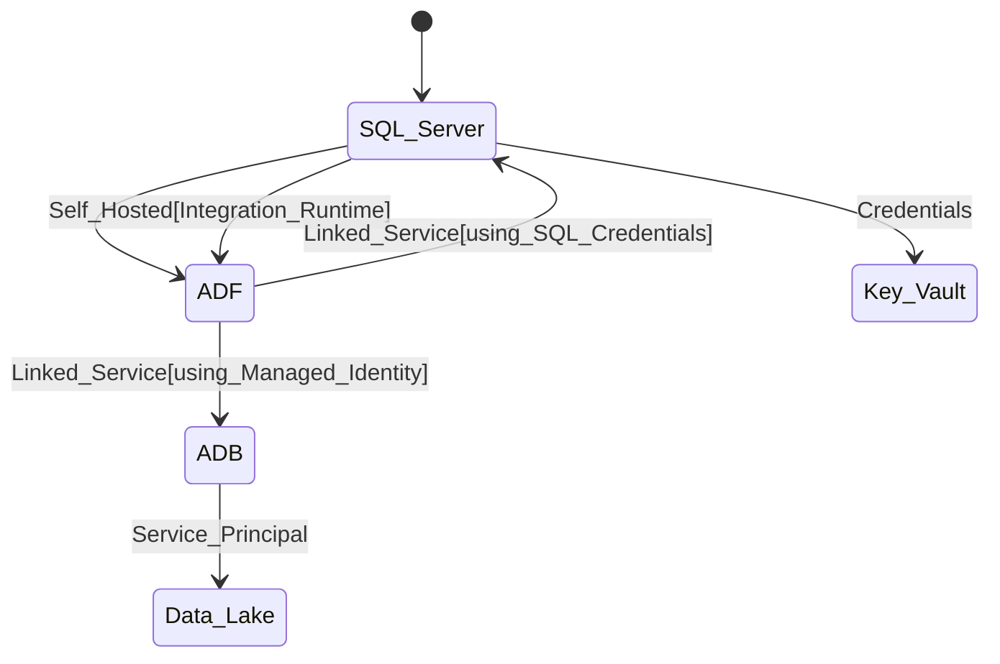

### NOTE: I am not a full time Data Engineer . I did not use LLM , as I did work on a similar request rcently for our Infrastructure at current Org, so basically have some idea over this question .
 # Azure Platform Side set up for STRADA team (using Azure Terraform)

    	a. Creation of VNET & Subnets for Azure data Factory, Azure Data Bricks , Storage Account
      1. We can create Network security groups and Private Endpoints for security of the data and who can access the data. We can also use Private DNS Zone. As this security resources use private network instead of over the Internet, we are much secure over the Microsoft back bone network.

    	b. Creation of Resource Group to host ADF, ADB, Storage Account for Data Lake, Azure Key vault
   		c. Creation of ADF
   		d. Creation of Storage account with Hirearchial Namespace = true (which is a important setting to use Data Lake for Azure Data Bricks). 
   		e. Creation of Azure Data Bricks Service (uses 2 subnets for Public and Private exposure of ADB)
   		d. Creation of Azure Key vault to store On-Prem SQL Server (login and password) .
# RBAC
1. Storage Account Blob Contributor for Service principal which helps Azure Data Bricks to communicate with Data Lake.
2. Azure Data Factory to Azure Data Bricks communication grant contributor level access for communication.

     
# strada-DE-Infra
For STRADA team Azure Infra set up via Automation using Azure Terraform

# Connectivity
1. SQL Server ( Source for the data) and we need Self hosted Integrated Runtime (IR) for moving the data from the On-premises to Cloud
2. Azure Data Factory (Data Ingesion from SQL Server)
3. Azure Data Lake & Azure Data Bricks (For Preparing the data and Transforming the data for final loading & reporting)

# High level Architecture diagram

## Explanation of architecture and azure infra and the azure services connectivity

Provision separate environments (dev, tst, prd) for a new STRADA downstream data team at Van Lanschot Kempen . This team will need the following Azure services:
•	Azure Databricks
•	Storage Account
•	Data Factory
•	Key Vault
•	SQL Server

Basically , the whole architecture of this project as I assume:

1. Starts with data from SQL Server (assuming On-Prem SQL Server) data ingestion into Azure Data Factory(ADF) via ADF Pipelines service. This is done by creating a Linked Server from ADF to SQL Server using the credentials created at SQL Server.
2. Next step is ADF to Azure Data Lake(ADL) and Azure Data Bricks Services (ADB) using managed Identity.
3. Azure Data Bricks is connected to Azure Data Lake via a Service Principal created at Entra ID and by granting necessary access to service principal for Azure storage account container( which is made as data lake by enabling the Hirearchial namespace option).
4. During all this process we can use Azure Key Vault to store the Credentials from SQL Server or PAT function

## Azure DevOps Pipeline trigger

1. A new pipeline can be created using the tf_plan_apply.yml . Please opt for using existing option while creating new pipeline.
2. When you try to run the pipeline as we have 3 distinct subsciprtions 'dev' , 'tst', 'prd' , the pipleine gives us options which environment to work with like shown in the below image.

