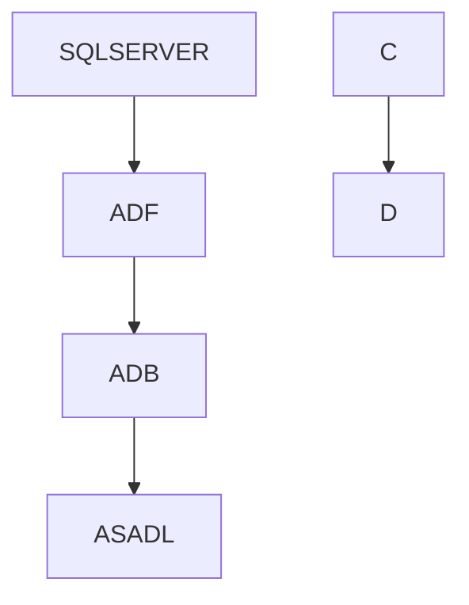
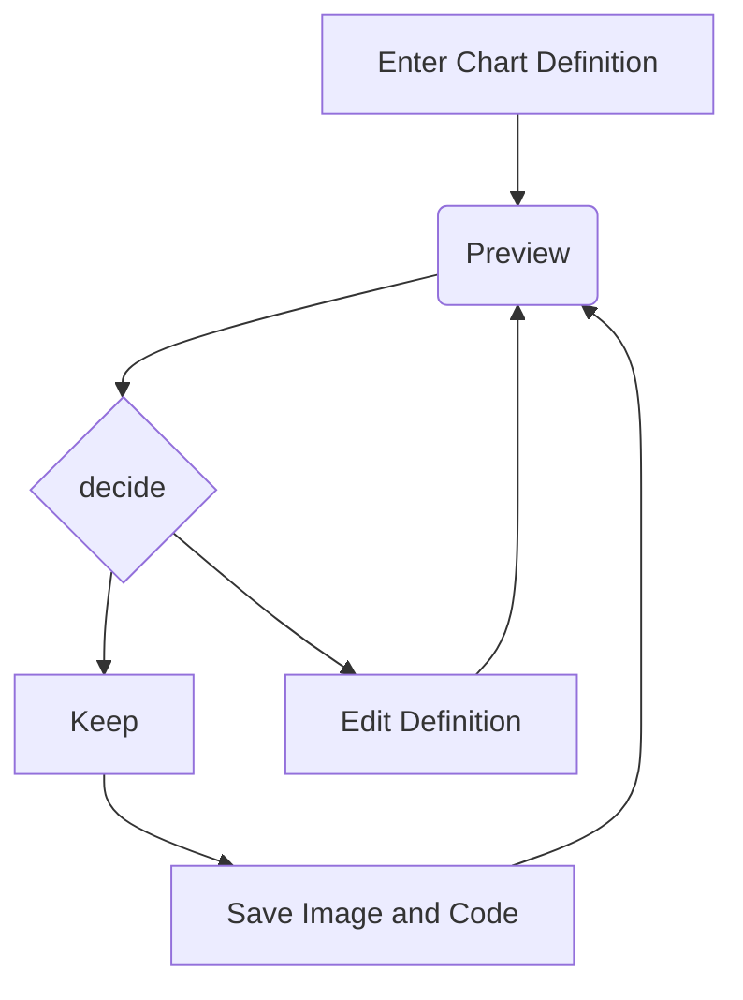
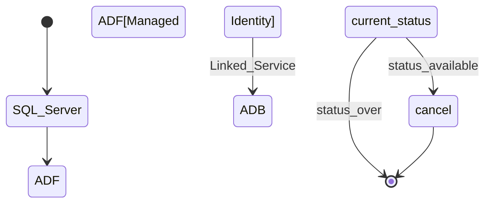

 # Azure Platform Side set up for STRADA team (using Azure Terraform)
1. First step will be set up of Virtual Network
    a. Creation of VNET & Subnets for Azure data Factory, Azure Data Bricks , Storage Account
    b. Creation of Resource Group
   c. Creation of ADF
   d. Creation of Storage account with Hirearchial Namespace = true (which is a important setting to use Data Lake for Azure Data Bricks)
   e. Creation of Azure Data Bricks Service (uses 2 subnets for Public and Private exposure of ADB)
   d. Creation of Azure Key vault to store On-Prem SQL Server (login and password) .

# strada-DE-Infra
For STRADA team Azure Infra set up via Automation using Azure Terraform

## Explanation of architecture and azure infra and the azure services connectivity

Provision separate environments (dev, tst, prd) for a new STRADA downstream data team at Van Lanschot Kempen . This team will need the following Azure services:
•	Azure Databricks
•	Storage Account
•	Data Factory
•	Key Vault
•	SQL Server

Basically , the whole architecture of this project as I assume:

1. Starts with data from SQL Server (assuming On-Prem SQL Server) data ingestion into Azure Data Factory(ADF) via ADF Pipelines service. This is done by creating a Linked Server from ADF to SQL Server using the credentials created at SQL Server.
2. Next step is ADF to Azure Data Lake(ADL) and Azure Data Bricks Services (ADB) using managed Identity.
3. Azure Data Bricks is connected to Azure Data Lake via a Service Principal created at Entra ID and by granting necessary access to service principal for Azure storage account container( which is made as data lake by enabling the Hirearchial namespace option).
4. During all this process we can use Azure Key Vault to store the Credentials from SQL Server or PAT function

